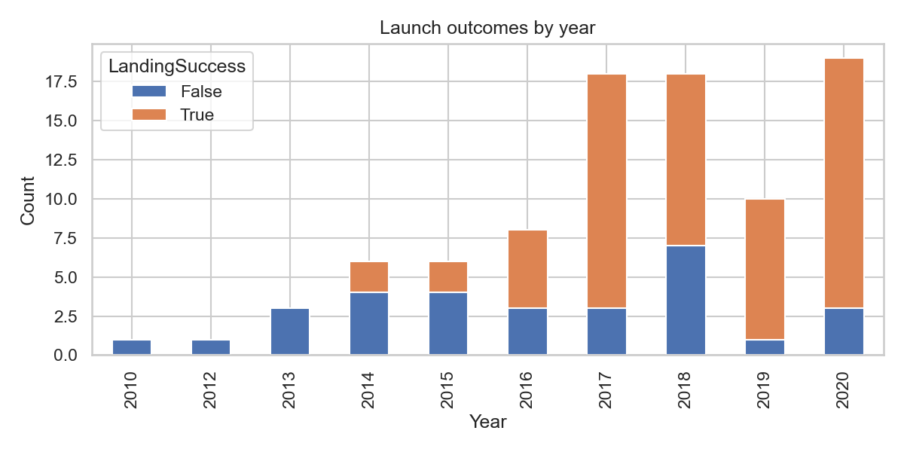
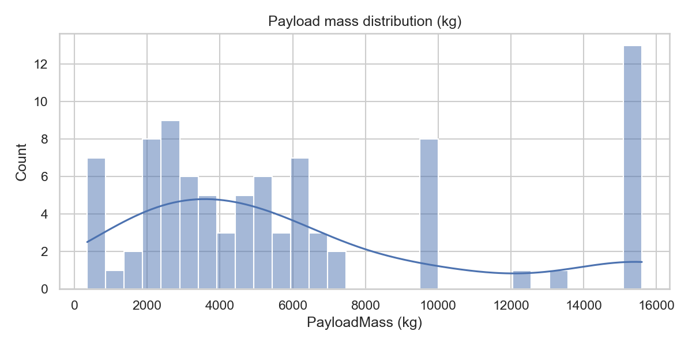
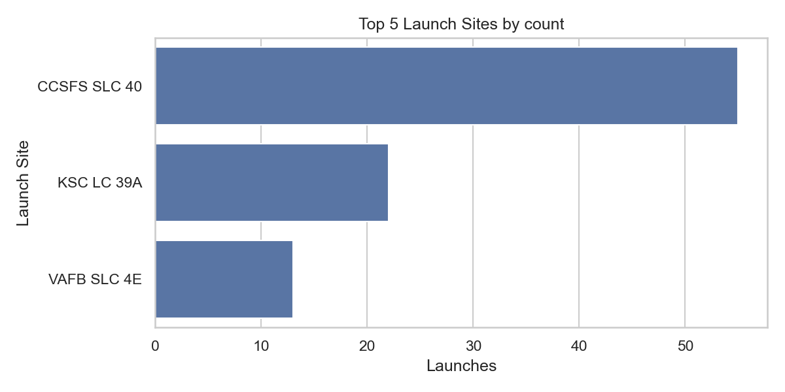

# EDA and SQL Summary — SpaceX Falcon 9

Generated: 2025-08-26T12:16:26

## Dataset (merged) shape
Rows: 90, Columns: 25

## Head (first 5 rows)
```
 FlightNumber       Date BoosterVersion  PayloadMass Orbit   LaunchSite     Outcome  Flights  GridFins  Reused  Legs LandingPad  Block  ReusedCount Serial   Longitude  Latitude   Customer  Payload mass (kg) Launch site  Version Booster  payload_diff_kg  payload_within_50kg  LandingSuccess  Year
            1 2010-06-04       Falcon 9  6123.547647   LEO CCSFS SLC 40   None None        1     False   False False        NaN    1.0            0  B0003  -80.577366 28.561857     SpaceX                NaN       CCAFS F9 v1.07B0003.18              NaN                False           False  2010
            2 2012-05-22       Falcon 9   525.000000   LEO CCSFS SLC 40   None None        1     False   False False        NaN    1.0            0  B0005  -80.577366 28.561857 NASA(COTS)              525.0       CCAFS F9 v1.07B0005.18              0.0                 True           False  2012
            3 2013-03-01       Falcon 9   677.000000   ISS CCSFS SLC 40   None None        1     False   False False        NaN    1.0            0  B0007  -80.577366 28.561857        NaN                NaN         NaN              NaN              NaN                False           False  2013
            4 2013-09-29       Falcon 9   500.000000    PO  VAFB SLC 4E False Ocean        1     False   False False        NaN    1.0            0  B1003 -120.610829 34.632093        NaN                NaN         NaN              NaN              NaN                False           False  2013
            5 2013-12-03       Falcon 9  3170.000000   GTO CCSFS SLC 40   None None        1     False   False False        NaN    1.0            0  B1004  -80.577366 28.561857        SES             3170.0       CCAFS          F9 v1.1              0.0                 True           False  2013
```

## Missing values by column
```
FlightNumber            0
Date                    0
BoosterVersion          0
PayloadMass             0
Orbit                   0
LaunchSite              0
Outcome                 0
Flights                 0
GridFins                0
Reused                  0
Legs                    0
LandingPad             26
Block                   0
ReusedCount             0
Serial                  0
Longitude               0
Latitude                0
Customer               48
Payload mass (kg)      51
Launch site            48
Version Booster        48
payload_diff_kg        51
payload_within_50kg     0
LandingSuccess          0
Year                    0
```

## SQL — By Orbit
```
Orbit  launches
  GTO        27
  ISS        21
 VLEO        14
   PO         9
  LEO         7
  SSO         5
  MEO         3
   SO         1
  HEO         1
  GEO         1
ES-L1         1
```

## SQL — Success Rate By Site
```
  LaunchSite  landing_success_rate  n
  KSC LC 39A              0.944444 22
CCSFS SLC 40              0.846154 55
 VAFB SLC 4E              0.833333 13
```

## SQL — Avg Payload By Site
```
  LaunchSite  avg_payload_kg  n
  KSC LC 39A         7644.50 22
 VAFB SLC 4E         5919.46 13
CCSFS SLC 40         5563.40 55
```

## SQL — Top Customers
```
              Customer  launches
               Unknown        48
                   SES         5
                  USAF         2
               Thaicom         2
               Telesat         2
SKY Perfect JSAT Group         2
               Orbcomm         2
               AsiaSat         2
                  USSF         1
 U.S. Space Force[530]         1
```

## Visualizations






